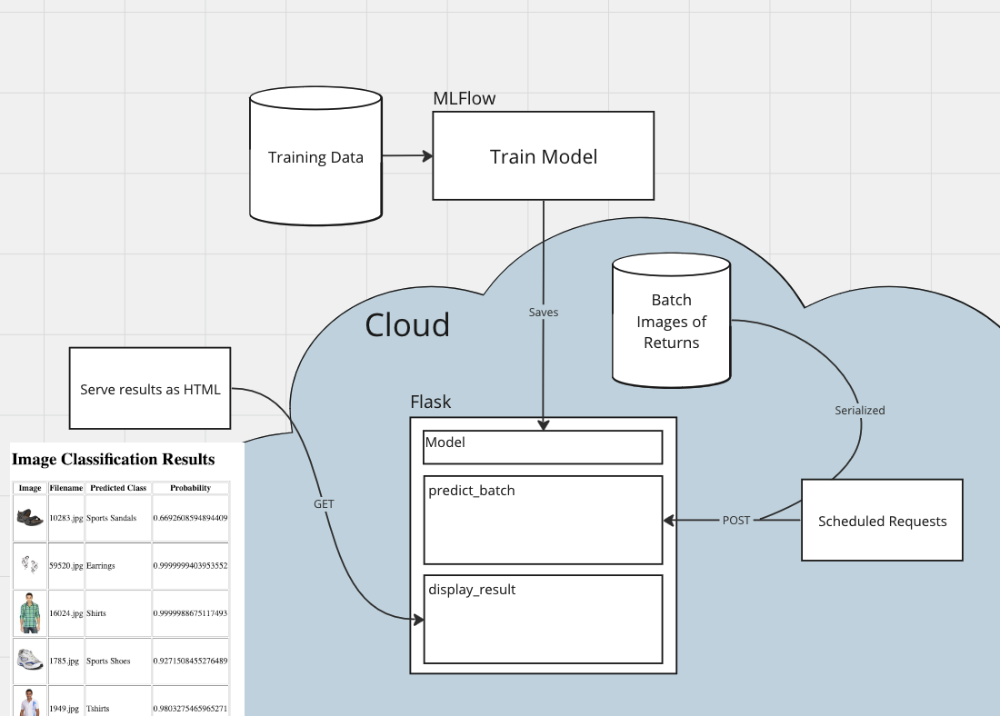

# Image Classification as a Service

This is a demonstration of what an image classification service using mlflow and flask can look like. The model is trained to predict classes of fashion items. A possible use case is processing returns in online shopping. 

## split.py 
splits the dataset into training, validation and testing sets. 

## model.py 
trains the model and saves it's properties as h5-file

## app.py

Flask app, where you can sent POST requests to predict the classes of a batch of images. A GET request to localhost:PORT/results will display a table with the image, the predicted class and the associated probability.

## requests.py

A little script that serializes the batch data and sends the POST request to trigger the batch processing of images. 
